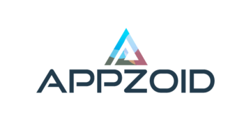

    
     
    <b>Appzoid is a Backend-as-a-Service — BaaS — that provides web and mobile developers with a set of easy-to-use and satisfy their core backend needs.</b>
     
     

## Contributing

All code contributions - including those of people having commit access - must go through a pull request and approved by a core developer before being merged. This is to ensure proper review of all the code.

I truly ❤️ pull requests!

## Contact

If you want to contact me you can reach me at [ezedin.fedlu@gmail.com](mailto:ezedin.fedlu@gmail.com).

## License

This project is licensed under the [MIT License](./LICENSE).
